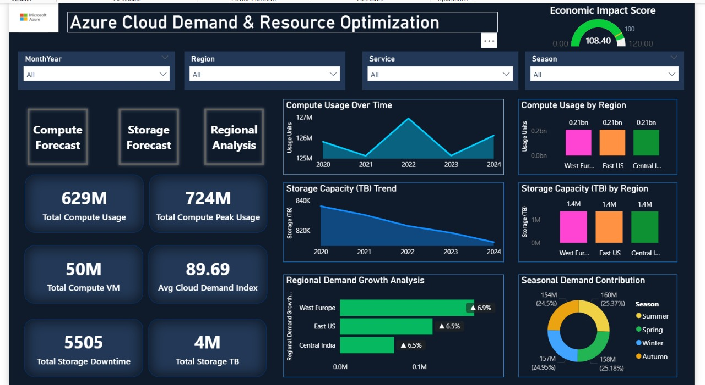
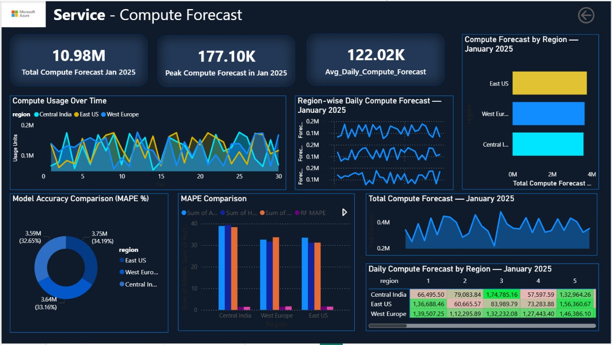
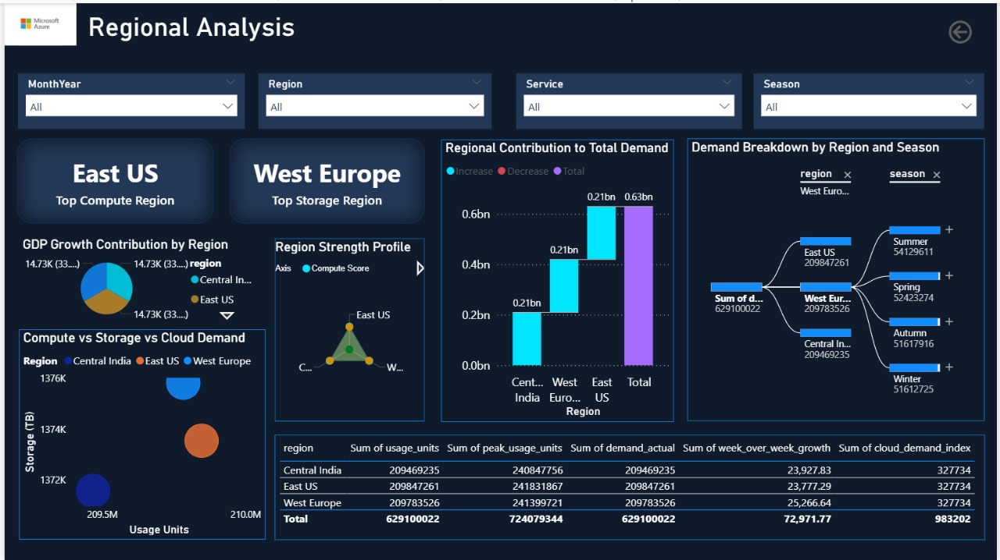

# Azure-based Demand Forecasting and Capacity Optimization System

## 📘 Overview

This project implements a complete end-to-end **cloud-based forecasting and capacity optimization system** designed to predict Azure Compute and Storage demand using multi‑cloud data ingestion, advanced feature engineering, Databricks-based processing, machine learning models, and Power BI dashboards.

It brings together data from **Snowflake**, **Google Cloud Platform**, and **API sources**, processes them through an Azure Lakehouse architecture, trains high‑accuracy ML models, and visualizes insights for capacity planning.

## 🏛 Architecture

## 🎬 Demo Video
[Watch the demo video](Azure-Based Demand Forecasting and Capacity Optimization Project.mp4)

---

## 1. 📂 Data Sources

The solution merges three enterprise-wide data sources:

### **✔ Snowflake Database**

* Internal Azure usage data
* Infrastructure provisioning, SKU-level consumption
* Historical demand logs

### **✔ Google Cloud Platform (GCP)**

* External market demand indicators
* Cloud infrastructure usage metrics
* Global compute/storage trend signals

### **✔ Render API**

* Real-time utilization metrics
* Live consumption indicators

These diverse inputs provide a complete 360° view of both **internal** and **external** cloud demand drivers.

---

## 2. 🔄 Data Ingestion Layer

The ingestion pipeline is powered by:

### **✔ Azure Data Factory (ADF)**

* Automated ingestion pipelines
* Secure connectors to Snowflake, GCP, and APIs
* Logging, monitoring, and scheduling

### **✔ Azure Data Lake Storage (ADLS)**

* Central data repository
* Organized into folder hierarchies
* Optimized for Databricks Lakehouse workflows

This ensures scalable, fault‑tolerant ingestion.

---

## 3. 🔧 Data Processing Layer (Azure Databricks)

Azure Databricks is the transformation engine using the **Medallion Architecture**.

### **🏅 Bronze Layer (Raw)**

* Stores unmodified ingested data
* Maintains full source lineage

### **🥈 Silver Layer (Clean + Enriched)**

* Data cleaning, preprocessing
* Feature engineering (lags, rolling windows, seasonality, external factors)
* Time series normalization

### **🥇 Gold Layer (Curated + Model‑Ready)**

* Final dataset used for ML modeling and dashboards

This layered approach ensures data reliability and high-quality inputs.

---

## 4. 🤖 Machine Learning Model Training

The modeling pipeline trains multiple forecasting models in Databricks ML runtime:

### **Models Used**

* **Random Forest Regressor** → *Best performer*
* **XGBoost Regressor**
* **Prophet**
* **Auto-ARIMA**

### **Outputs**

* Compute demand forecasts
* Storage demand forecasts
* Weekly & monthly trends
* MAE, RMSE, SMAPE metrics**
* Compute demand forecasts
* Storage demand forecasts
* Weekly & monthly trends
* MAE, RMSE, SMAPE metrics

---

## 5. 📊 Visualization Layer (Power BI)

Forecast outputs are visualized using Power BI dashboards, providing:

* Real-time interactive visuals
* Compute & storage demand trends
* Regional capacity insights
* Forecast performance analytics

### Dashboard Preview

### Dashboard Preview

### 📌 Dashboard Link

## Power BI Dashboard

You can view the live dashboard here: [Power BI Dashboard](https://app.powerbi.com/view?r=eyJrIjoiOGYxYTA5NWMtZTg3NC00Nzk4LThjZjMtNDVlMmE2OTc1ZmI2IiwidCI6IjE1YzM0OWUxLTBjNTUtNDYwOS1iMzNhLWM2MjJkOWU2NjRlYSJ9)

---

## 📝 Summary

This project delivers a fully integrated Azure-based forecasting system that:

* Ingests data from **Snowflake, GCP, and APIs** using ADF
* Stores and processes data through a **Databricks Lakehouse**
* Trains high-accuracy machine learning models
* Predicts Compute & Storage demand for Azure regions
* Publishes real-time insights to Power BI

The solution significantly improves Azure’s **capacity planning**, helps reduce **over/under‑provisioning**, and increases **infrastructure efficiency**.

---

## 📄 License

This project is licensed under the **MIT License**.

